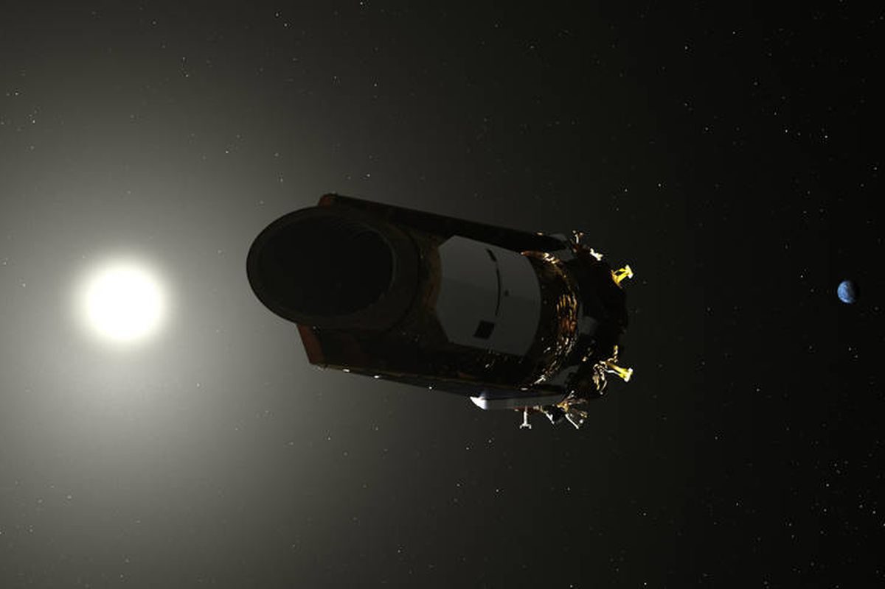
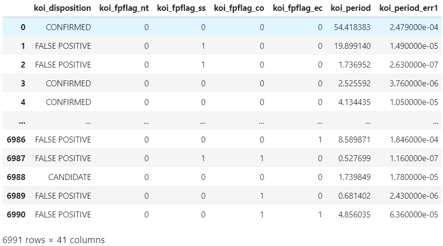

# Macine-Learning-Challenge

## Using Machine Learning Models to Predict Exoplanets

The purpose of this project is to predict in accuracy Exoplanets with given data using Machine Learning Models. 
The dataset used is a sample dataset released by NASA, which is available in Kaggle.
Link to the dataset: https://www.kaggle.com/nasa/kepler-exoplanet-search-results

The dataset was collected using Kepler Space Telescope that was first launched in 2009.

## Dataset summary

Number of Observations (candidate planets): 6991
Number of Features: 40
Output Variable (Y): koi_disposition
N/A values: None

## Models used

Three different models were used in order to find the best models:
I.   Support Vector Machine (SVM)
II.  K-Nearest Neighbor (KNN)
III. Deep Learning Model (RNN with adam Optimizer)

For each notebooks, data and model will be loaded in, standardized, and predicted. In addition, SVM and KNN models will also be hyperparameter tuned using GridSearch to try to search for the best model. In addition, SVM and KNN models will be saved using Joblib library, while Deep Learning model will be saved in the format of hdf5.

## Best Model (Deep Learning Model)
Results
  SVM: 0.885
  KNN: 0.816
  RNN: 0.903
The best model to predict the exoplanets was Deep Learning Model with 0.9027 accuracy. KNN turned out to be the worst model overall for predicting this dataset.

## Notes and New Findings
The dataset lacked explanation of most features, making it extremely difficult to try feature engineering.
Removing features for noise reduction did not improve the models, even for SVM.
Running logistic Regression to find the importance of each features were not as helpful, since it seems that different models have different importance for each features.
Normalization of some of the data did not help improve the model accuracy.

## Libraries used
Pandas
Sklearn
Numpy
Matplotlib
Seaborn
Joblib
GridSearchCV
Tensorflow
